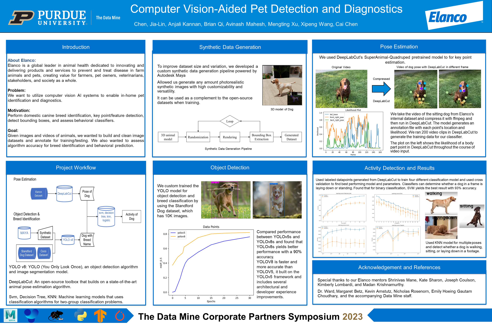

 

 

Our team partnered with Elanco and utilized state-of-the-art machine learning models to enable in-home pet identification and diagnostics. The program processes real-time footage and outputs the breed of the pet, the location of its bounding box, and the current pose of the pet. These data can then be used to run inferences and analyze if there are any underlying health conditions for the pet. The workflow of the project involves transfer learning of the YOLOv8s object detection model for bounding box and breed information, pose estimation using DeepLabCut-Live, and developing a custom pose classifier using the pose estimation output.

As the team leader, I led the data processing and cleaning efforts, fine-tuned the YOLOv8s model using transfer learning, set up DeepLabCut-Live for real-time pose estimation, and played an instrumental role in developing and optimizing our pose classification models through cross-validation and ensemble techniques.

We presented our work during [The Data Mine Corporate Partners Symposium, 2023](https://datamine.purdue.edu/symposium/).

Citation: 
Wang, X., Chen, C., Qi, B., Xu, M., Kannan, A., Chen, J., Mahesh, A. (2023, April 24). Computer Vision-Aided Pet Detection and Diagnostics. [Poster Presentation]. The Data Mine Corporate Partners Symposium, 2023, West Lafayette, IN, United States.
