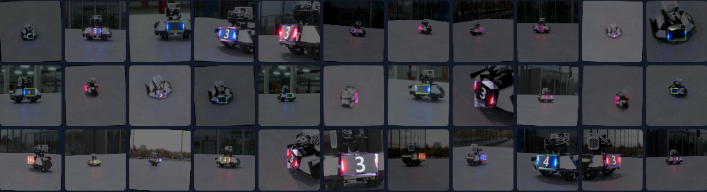

The data collection processes can be costly and time-consuming when training any machine learning model. Our versatile and easy-to-use synthetic data generation toolkit tackles this issue by allowing users to generate any amount of photorealistic image data with pixel-perfect annotation. The only thing the user needs to input is the 3D model of the object and randomization parameters.

In this project, I led a team of three undergraduate student researcher to complete the following stages of data generation:
 - Model Import
 - Parameter Randomization
 - Rendering the Image and Annotation Extraction
 - Dataset Generation
 - Custom Training of YOLOv5 Object Detection Model
 - Evaluation and Iterative Improvement

The work is presented as a research talk during the 2023 Purdue <a href="https://www.purdue.edu/undergrad-research/conferences/spring/archive/documents/AbstractBooklet_Spring2023.pdf#page=442">Spring Undergraduate Research Conference</a>.

Wang, X., Xu, M., Yu, G. (2023, April 13). Synthetic Data Generation for RoboMaster Amor Plate Detection [Oral
Presentation]. 2023 Purdue Spring Undergraduate Research Conference, West Lafayette, IN, United States.

Source: <a href="https://github.com/xipengwang-alex/synthetic-armorplate">xipengwang-alex/synthetic-armorplate</a>
